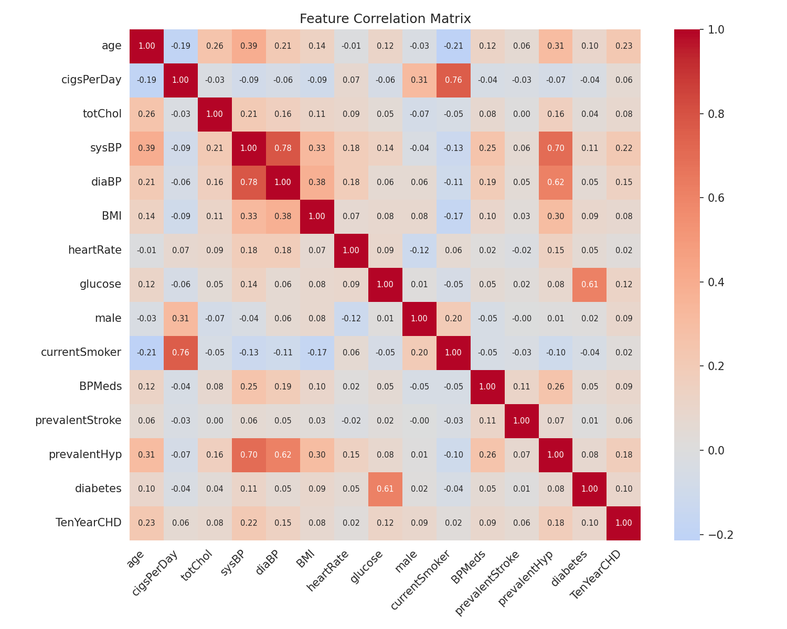
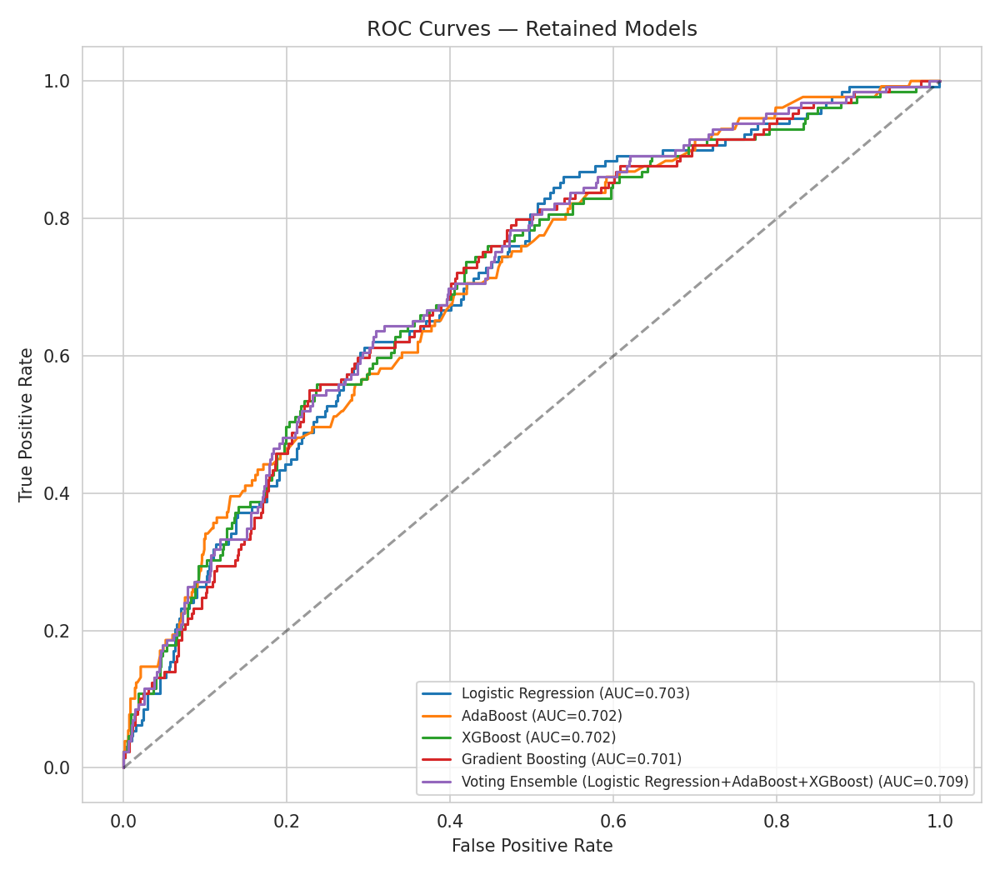
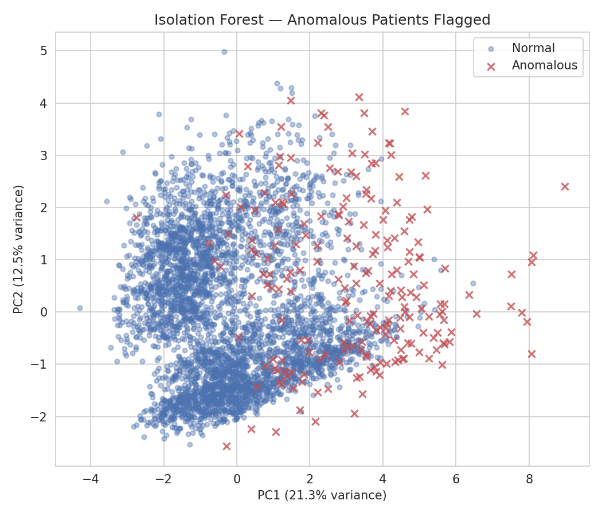

# 10-Year Coronary Heart Disease Risk — A Data Mining Project

A broader, deeper data mining study than a typical intro project, built on the **Framingham Heart Study dataset** — 4,240 patients, larger and messier than a small curated benchmark, with genuine missing data and real class imbalance. Seven techniques are applied end-to-end and rigorously filtered down to the ones that actually work.

📓 **[Open the full walkthrough notebook](notebooks/heart_disease_data_mining.ipynb)**

## Overview

| | |
|---|---|
| **Domain** | Healthcare / cardiovascular risk prediction |
| **Dataset** | [Framingham Heart Study](https://raw.githubusercontent.com/sta210-sp20/datasets/master/framingham.csv) — 4,240 patients, 15 clinical/lifestyle features |
| **Task** | Binary classification (10-year CHD risk) + risk segmentation + anomaly detection + pattern discovery |
| **Techniques** | Feature selection, classification (11 algorithms + ensemble), 2 clustering algorithms compared, anomaly detection, association rules |
| **Best model** | Voting Ensemble (Logistic Regression + AdaBoost + XGBoost) — **70.9% ROC-AUC** |

## Why this dataset (and why it's a step up from a smaller project)

The Framingham Heart Study is the dataset that originally established "risk factor" as a concept in cardiovascular epidemiology. Compared to a small, clean benchmark like the Pima Indians Diabetes dataset (768 rows, no real missing data, roughly balanced classes), Framingham is:
- **~5.5x larger** (4,240 vs. ~770 patients)
- Has **genuine missing values** across 7 columns (not placeholder zeros) — real imputation decisions required
- Is **imbalanced** (~15% positive class) — requires resampling technique, and requires getting that technique *right* (see the SMOTE leakage story below)
- Has **more feature types** (binary, ordinal, continuous) — supports richer feature selection and association-rule work

This scale and messiness justifies using more techniques than a smaller project would need, and each one below earned its place by producing a result that held up under scrutiny.

## Project structure

```
heart-disease-data-mining/
├── data/
│   ├── framingham.csv                # raw dataset
│   └── framingham_clean.csv          # cleaned + feature-engineered dataset
├── notebooks/
│   └── heart_disease_data_mining.ipynb   # full walkthrough, start here
├── src/
│   ├── preprocessing.py              # missing-value handling, feature engineering
│   ├── eda.py                        # exploratory data analysis + plots
│   ├── feature_selection.py          # Mutual Information + RFE, cross-checked
│   ├── classification.py             # 11-model comparison + SMOTE + voting ensemble
│   ├── clustering.py                 # K-Means vs. Hierarchical, compared
│   ├── anomaly_detection.py          # Isolation Forest + significance test
│   └── association_rules.py          # Apriori rule mining
├── results/
│   ├── figures/                      # all generated charts
│   ├── classification_results.csv
│   ├── cluster_profiles.csv
│   ├── association_rules.csv
│   └── *_notes.json                   # machine-readable "kept vs. dropped" decisions
├── requirements.txt
└── README.md
```

## Methodology

### 1. Preprocessing
`education` and `BPMeds` are imputed with mode/clinical-default logic; five continuous clinical measurements (`cigsPerDay`, `totChol`, `BMI`, `heartRate`, `glucose`) are imputed with the **median within each outcome class**.

### 2. Feature selection — two methods cross-checked
**Mutual Information** and **Recursive Feature Elimination** (Random Forest-based) independently agree on **age, systolic/diastolic BP, glucose, BMI, and heart rate** as core predictors — cross-method agreement is stronger evidence than either method alone.

### 3. Classification — 11 algorithms, SMOTE done correctly, ensemble on top

| Model | Test ROC-AUC | Verdict |
|---|---|---|
| **Voting Ensemble (LogReg+AdaBoost+XGBoost)** | **0.709** | ✅ Best overall |
| Logistic Regression | 0.703 | ✅ Kept |
| AdaBoost | 0.702 | ✅ Kept |
| XGBoost | 0.702 | ✅ Kept |
| Gradient Boosting | 0.701 | ✅ Kept |
| Extra Trees | 0.692 | ❌ Dropped |
| Random Forest | 0.677 | ❌ Dropped |
| Naive Bayes | 0.676 | ❌ Dropped |
| SVM (RBF) | 0.654 | ❌ Dropped |
| K-Nearest Neighbors | 0.650 | ❌ Dropped |
| Decision Tree | 0.646 | ❌ Dropped |
| Neural Network (MLP) | 0.598 | ❌ Dropped |

**A methodological note worth keeping visible:** an earlier version of this pipeline applied SMOTE *before* splitting into cross-validation folds. That leaked synthetic-neighbor information across folds and produced misleadingly optimistic CV scores (Gradient Boosting showed 0.92 CV-AUC but only 0.69 test-AUC — a dead giveaway of leakage). The fix: SMOTE is now applied **inside** each CV fold via an `imblearn` pipeline, and model selection is based on the unbiased **test** metric rather than CV. This is the kind of mistake that's easy to make and important to catch — it's documented here rather than quietly fixed and forgotten.

### 4. Clustering — two algorithms compared head-to-head
K-Means and Agglomerative Hierarchical Clustering were run independently (no CHD label used). **Both algorithms converge on a similar high-risk subgroup** — ~35-37% CHD prevalence in one cluster vs. ~10-11% in the lowest-risk cluster, against a 15.2% baseline. Agreement between two different algorithms is stronger evidence than either alone.

### 5. Anomaly detection
**Isolation Forest** flags the 5% of patients with the most statistically atypical combination of vitals. These patients have **37.7% CHD prevalence vs. 14.0%** for typical patients — a highly significant difference (χ²=86.2, p<10⁻¹⁹), suggesting unusual vitals combinations carry independent risk signal.

### 6. Association rule mining
Apriori on discretized clinical + lifestyle categories, filtered to rules that specifically predict **CHD** (not the trivially-easy majority "No CHD" class), with confidence ≥ 0.25 and lift ≥ 1.3 — **74 rules kept out of ~30,000 candidates**. Strongest: *{Age 60+, Hypertensive}* → *{CHD, High Cholesterol}* (34% confidence, 3.0× lift).

## Key figures

| Correlation heatmap | ROC curves (kept models) | Anomaly detection |
|---|---|---|
|  |  |  |

## Results summary

| Technique | Outcome | Kept? |
|---|---|---|
| Classification (5 of 11 models + ensemble) | Best ROC-AUC 0.709 | ✅ |
| K-Means vs. Hierarchical clustering | Both agree: ~25pp prevalence spread | ✅ |
| Isolation Forest anomaly detection | 37.7% vs 14.0% CHD rate, p<10⁻¹⁹ | ✅ |
| Apriori association rules | 74 clinically interpretable rules | ✅ |
| 7 of 11 individual classifiers | Test ROC-AUC < 0.70 | ❌ Reported, not recommended |

**Caveats:** Ceiling performance here (~0.70 AUC) is meaningfully lower than what's achievable on a cleaner, more separable dataset like Pima diabetes (~0.95 AUC) — and that's an honest finding, not a modeling failure: cardiovascular risk from these features alone is a genuinely hard prediction problem, matching what's published in the clinical literature on this exact dataset. Class imbalance means default-threshold recall is low across all models; real clinical use would need threshold tuning or a cost-sensitive objective. Results reflect a single historical cohort (Framingham, MA, mid-20th century) and shouldn't be assumed to generalize elsewhere without re-validation.

## Reproducing this project

```bash
git clone <your-repo-url>
cd heart-disease-data-mining
pip install -r requirements.txt

python3 src/preprocessing.py         # cleans data -> data/framingham_clean.csv
python3 src/eda.py                   # generates EDA figures
python3 src/feature_selection.py     # MI + RFE feature selection
python3 src/classification.py        # trains/evaluates 11 models + SMOTE + ensemble
python3 src/clustering.py            # K-Means vs. Hierarchical comparison
python3 src/anomaly_detection.py     # Isolation Forest + significance test
python3 src/association_rules.py     # Apriori rule mining

# Or just open the full walkthrough:
jupyter notebook notebooks/heart_disease_data_mining.ipynb
```

## Tech stack
`pandas` · `numpy` · `scipy` · `scikit-learn` · `xgboost` · `imbalanced-learn` (SMOTE) · `mlxtend` (Apriori) · `matplotlib` / `seaborn` · Jupyter

## License / data attribution
Dataset from the Framingham Heart Study (NHLBI / Boston University), distributed as a teaching dataset. Retrieved from the public mirror at [sta210-sp20/datasets](https://github.com/sta210-sp20/datasets).
